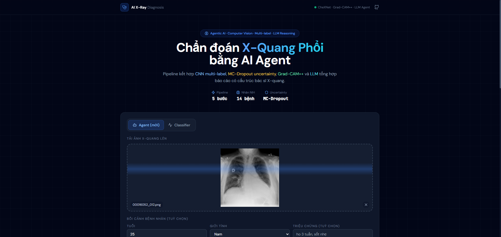
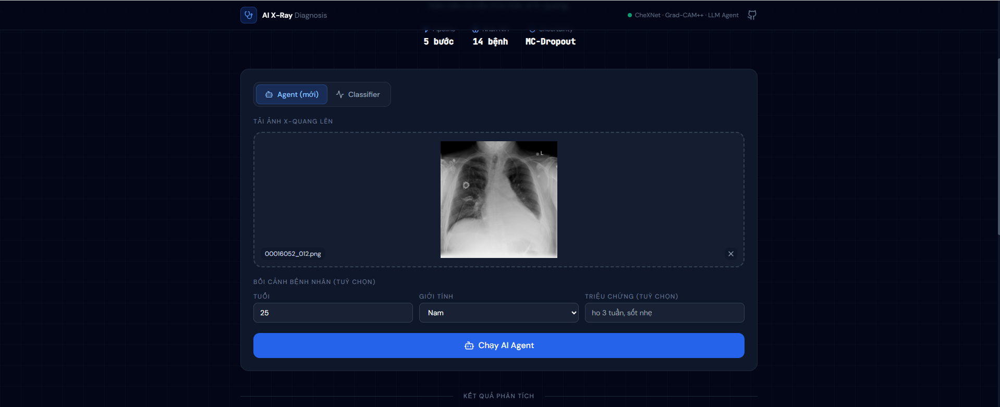
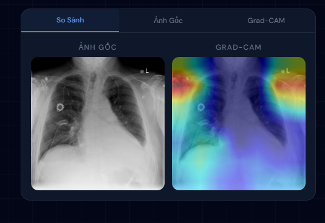
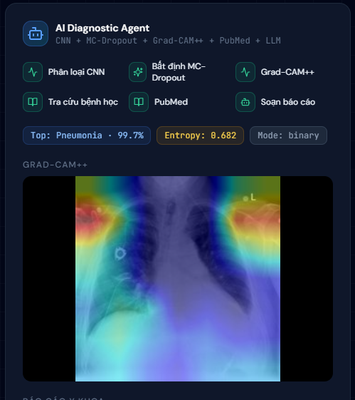
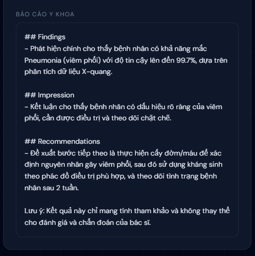

# AI Chest X-Ray Assistant — Clinical Decision Support Pipeline

**Hệ trợ lý phân tích X-quang ngực** kết hợp học sâu có giải thích (explainable AI), ước lượng độ tin cậy, và tổng hợp báo cáo dạng *findings / impression / recommendations* — thiết kế cho **hỗ trợ lâm sàng và đào tạo**, không thay thế bác sĩ X-quang hay chẩn đoán cuối cùng.

[](https://github.com/LuongVu1120/xray)


---

## Demo ảnh & video

**Tổng quan giao diện**



**Luồng thao tác (screenshots)**

| Bước 1 | Bước 2 |
|:------:|:------:|
|  |  |

| Bước 3 | Bước 4 |
|:------:|:------:|
|  |  |

**Video hướng dẫn (screen recording, ~40 MB)**

- [Mở / tải `demo-walkthrough.mp4`](docs/media/videos/demo-walkthrough.mp4)
- [Xem trực tiếp (raw trên GitHub)](https://github.com/LuongVu1120/xray/raw/main/docs/media/videos/demo-walkthrough.mp4)

Danh sách file và quy ước đặt tên: **[docs/media/README.md](docs/media/README.md)**.

---

## Bối cảnh lâm sàng và khoa học

**Chụp X-quang ngực (chest radiography)** là xét nghiệm hình ảnh tuyến đầu trong nhiều tình huống: nghi viêm phổi, suy tim, tràn dịch/tràn khí màng phổi, sàng lọc trước phẫu thuật, theo dõi bệnh mạn. Ảnh phản ánh chồng lấn cấu trúc (tim, mạch, xương, mô mềm), nên **một tổn thương có thể biểu hiện không đặc hiệu** và **một bệnh nhân có thể mang nhiều bệnh lý đồng thời** — đúng với bản chất bộ dữ liệu công khai **NIH ChestX-ray14** (hơn 100.000 ảnh, nhãn đa mức độ, nhiều nhãn trên cùng một ảnh).

Dự án này mô phỏng quy trình mà các hệ thống *computer-aided detection/diagnosis (CADe/CADx)* hướng tới:

1. **Phân loại / phát hiện** các pattern bất thường trên phim (từ mô hình nhị phân, 3 lớp lâm sàng đơn giản, tới **đa nhãn 14 thể bệnh** theo chuẩn NIH).
2. **Giải thích vùng quan tâm** bằng **Grad-CAM++** — giúp người đọc hiểu vùng ảnh mà mạng nơ-ron “nhấn mạnh”, hữu ích cho giảng dạy và kiểm tra lý luận của mô hình (không tương đương tiêu chuẩn vàng như chẩn đoán bác sĩ).
3. **Ước lượng bất định (uncertainty)** qua **MC-Dropout** — khi entropy cao, kết quả nên được xem là “mơ hồ”, phù hợp với thực hành an toàn: **không dựa vào một điểm số duy nhất** mà bỏ qua lâm sàng.
4. **Tổng hợp báo cáo có cấu trúc** (kèm tra cứu PubMed khi bật) — hỗ trợ diễn đạt, vẫn cần **xác minh bởi người có chuyên môn**.

**Giới hạn y học và đạo đức lâm sàng:** mô hình huấn luyện trên dataset cụ thể (độ phân giải, quần thể, gắn nhãn nhiễu) có thể **không khái quát hóa** sang máy chụp khác, bệnh viện khác, hoặc nhóm bệnh nhân khác. Thiết bị này **không phải thiết bị y tế được cấp phép**; mục đích: nghiên cứu, portfolio, và minh họa pipeline AI trong y tế.

---

## Tính năng kỹ thuật (tóm tắt)

| Lớp | Nội dung |
|-----|----------|
| **Mô hình** | DenseNet121; tự nhận **1 / 2 / 3 / 14 đầu ra** (sigmoid đa nhãn hoặc softmax tùy checkpoint). **TTA** (lật ảnh + crop) khi inference Keras. |
| **Giải thích** | Grad-CAM và **Grad-CAM++** (định vị tốt hơn trên một số kiến trúc). |
| **Uncertainty** | MC-Dropout: entropy + độ lệch chuẩn theo lớp. |
| **Hiệu chỉnh xác suất** | Temperature scaling (tùy chọn, file `saved_model/temperature.json`). |
| **Agent** | Chuỗi công cụ: phân loại → bất định → heatmap → kiến thức bệnh học tóm tắt → PubMed (NCBI) → báo cáo **LLM streaming** (Groq/OpenAI-compatible) hoặc **template** khi không có API key. |
| **API** | `POST /predict` (JSON); `POST /agent/diagnose` (**SSE**). |

---

## Cài đặt và chạy

### Backend

```bash
cd backend
python -m venv .venv
# Windows: .venv\Scripts\activate
pip install -r requirements.txt
cp .env.example .env
# Điền MODEL_PATH, ALLOWED_ORIGINS, LLM_API_KEY (tuỳ chọn)
uvicorn main:app --reload --host 127.0.0.1 --port 8000
```

- Swagger: `http://127.0.0.1:8000/docs`
- **Lưu ý:** file `.env` không commit; chỉ dùng `.env.example` làm mẫu.

### Frontend

```bash
cd frontend
npm install
cp .env.local.example .env.local
# NEXT_PUBLIC_API_URL=http://127.0.0.1:8000
npm run dev
```

Mở `http://localhost:3000` — tab **Agent** (pipeline đầy đủ) hoặc **Classifier** (một lần gọi API).

---

## API chính

| Method | Endpoint | Mô tả |
|--------|----------|--------|
| GET | `/` | Trạng thái dịch vụ, model, LLM |
| GET | `/health` | Health check |
| GET | `/agent/tools` | Danh sách tool của agent |
| POST | `/predict` | Một ảnh → chẩn đoán + heatmap + khuyến nghị (JSON) |
| POST | `/agent/diagnose` | **SSE** — luồng sự kiện từng bước + báo cáo (stream) |

Ví dụ agent (terminal):

```bash
curl -N -X POST http://127.0.0.1:8000/agent/diagnose \
  -F "file=@chest_xray.jpg" \
  -F "patient={\"age\":65,\"sex\":\"male\",\"symptoms\":\"ho kéo dài, sốt nhẹ\"}" \
  -F "use_llm=true"
```

---

## Huấn luyện

- **Ba nhãn lâm sàng (Normal / Other / Pneumonia):** `backend/model/train.py` + Colab/GPU.
- **Mười bốn nhãn NIH (multi-label, sigmoid):** `backend/model/train_multilabel.py` — phù hợp bài toán “nhiều bệnh trên một ảnh” như trong thực hành X-quang bận rộn.

Checkpoint đặt trong `backend/saved_model/` (các file `.h5` lớn thường **không** đưa lên Git; dùng Drive/LFS tùy repo).

---

## Cấu trúc thư mục (rút gọn)

```
backend/
  main.py                 # FastAPI
  model/                  # predict, gradcam, uncertainty, calibration, train*
  agent/                  # orchestrator, tools, llm, pubmed, knowledge
  scripts/                # export_tflite, smoke tests
frontend/
  src/app/page.tsx        # UI Agent + Classifier
  src/lib/api.ts          # client + SSE
```

---

## Tác giả & giấy phép

**Vu Dai Luong** — dự án portfolio / nghiên cứu ứng dụng AI trong hình ảnh y tế.

MIT License © 2026

---

*Nếu bạn là nhà nghiên cứu lâm sàng: mọi số liệu hiệu năng trên tập validation cụ thể nên được báo cáo kèm đường cong ROC/PR và hiệu chỉnh trước khi cân nhắc bất kỳ ứng dụng nào ngoài môi trường thử nghiệm.*
